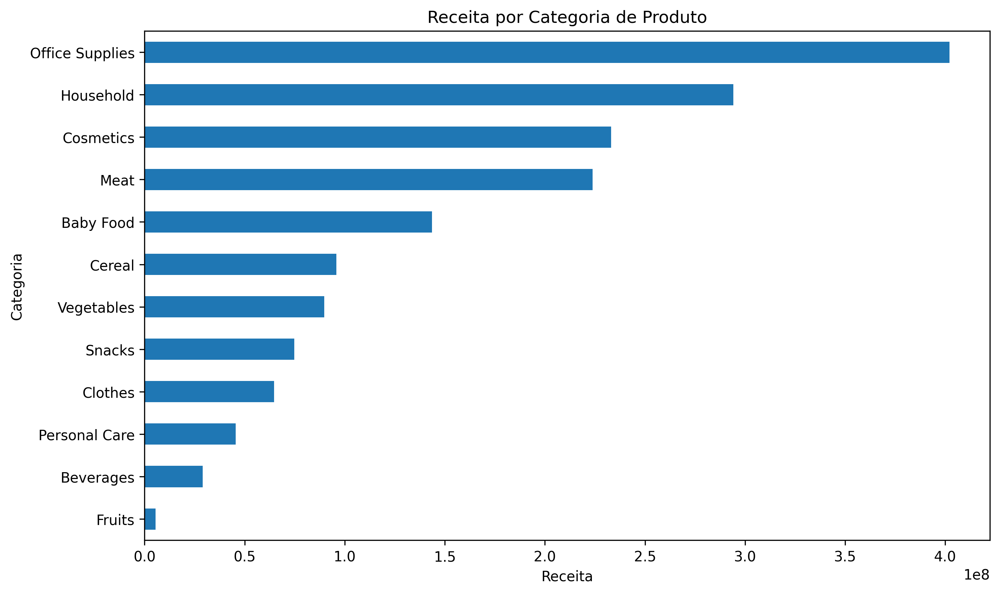
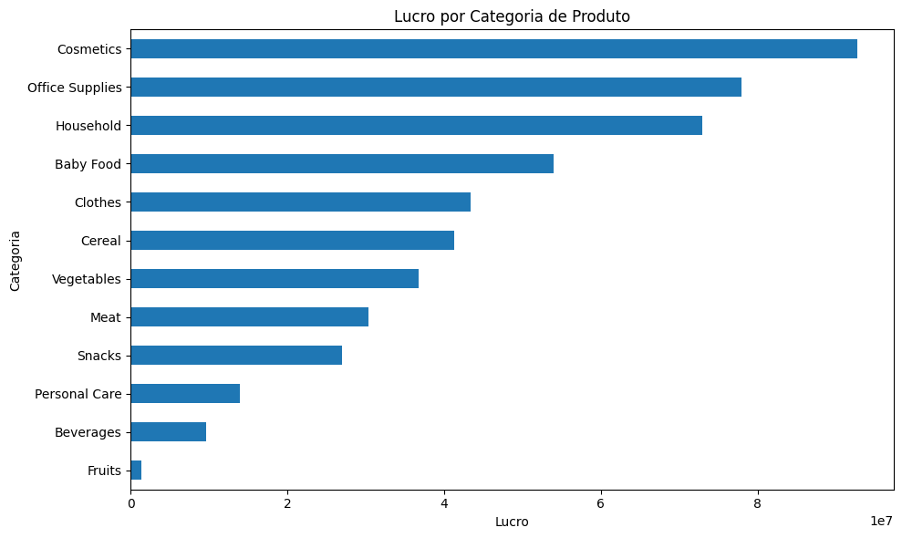

# 📊 Global Sales Data Analysis with Python
Exploratory Data Analysis (EDA) project developed with **Python**, **Pandas**, and **Matplotlib** to clean, analyze, and visualize global sales data, generating business insights through KPI analysis and data storytelling.

## 📌 Project Overview
This project analyzes global sales data to evaluate business performance across product categories, countries, regions, and sales channels.
The analysis covers the complete data analysis workflow, including data cleaning, transformation, exploratory data analysis (EDA), KPI creation, data visualization, and interpretation of business results.
The goal is to identify sales patterns, profitability differences, geographic performance, and operational insights that can support data-driven decision-making.

## 🎯 Business Questions
The analysis was developed to answer key business questions, including:
- Which product categories generate the highest revenue and profit?
- Which countries and regions show the strongest sales performance?
- How do Online and Offline sales channels compare in terms of revenue, cost, profit, and units sold?
- What is the average shipping time, and how does it vary across products and geographic markets?
- Is there a relationship between shipping time and profitability?
- How has sales revenue evolved over time?
- Are there relevant sales patterns across different days of the week?

## 📂 Dataset
The analysis uses three datasets containing sales, product, and geographic information:
- **events.csv** — order information, including order and shipping dates, sales channel, units sold, unit price, and unit cost.
- **products.csv** — product IDs and their respective product categories.
- **countries.csv** — country names, country codes, regions, and sub-regions.

The datasets were combined into a single DataFrame to enable an integrated analysis of sales performance, profitability, geography, and shipping behavior.

## 🛠 Technologies & Skills

### Technologies
- **Python** — data analysis and transformation
- **Pandas** — data cleaning, manipulation, aggregation, and DataFrame operations
- **Matplotlib** — data visualization
- **Google Colab** — development environment

### Skills Applied
- Data Cleaning and Preparation
- Exploratory Data Analysis (EDA)
- Data Transformation
- Data Integration
- KPI Creation
- Data Visualization
- Business Analysis
- Data Storytelling

## 📊 Key KPIs
After cleaning and integrating the datasets, the analysis resulted in the following key business indicators:

| KPI | Result |
|---|---:|
| Total Orders | 1,328 |
| Total Revenue | $1.70B |
| Total Profit | $501.43M |
| Units Sold | 6.58M |
| Product Categories | 12 |
| Country Codes | 46 (including Unknown) |
| Average Shipping Time | 24.78 days |

## 💡 Key Insights
- **Office Supplies** generated the highest revenue and also recorded the highest sales volume among the product categories.
- **Cosmetics** achieved the highest profit, showing that the category with the highest revenue is not necessarily the most profitable.
- **Europe** concentrated most of the company's revenue, profit, costs, and units sold, significantly outperforming Asia.
- The **Offline** sales channel slightly outperformed Online in revenue, profit, and units sold, although both channels showed similar overall performance.
- The average shipping time was approximately **24.78 days**, with some variation across product categories and geographic markets.
- No clear relationship was identified between **shipping time and profitability**.
- Revenue reached its highest level in **2012** and showed fluctuations in the following years.
- Sales were relatively balanced across the days of the week, with no strong evidence of weekly seasonality.

## 📈 Visualizations
### Revenue by Product Category

The analysis shows that **Office Supplies** generated the highest revenue, followed by **Household** and **Cosmetics**, highlighting the categories with the greatest contribution to overall sales.

### Profit by Product Category
While **Office Supplies** generated the highest revenue, **Cosmetics** achieved the highest profit, highlighting that higher revenue does not necessarily translate into higher profitability.

